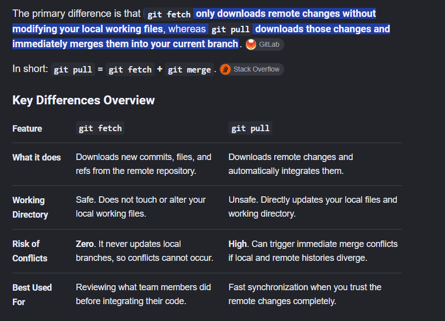

### git fetch vs pull



## Research + links
### Class Hardware support
- https://github.com/cu-ecen-aeld/aesd-assignments/wiki/Supported-Hardware-Platforms
- https://github.com/cu-ecen-aeld/buildroot-assignments-base/wiki
- https://github.com/cu-ecen-aeld/buildroot-assignments-base/wiki/Raspberry-Pi-Hardware-Support
- https://github.com/cu-ecen-aeld/buildroot-assignments-base/wiki/Flashing-Images-to-SDCard


### Buildroot setup
- https://github.com/cu-ecen-aeld/buildroot-assignments-base/wiki/Setting-up-Buildroot-for-Hardware-Builds
    - notes on how to configure the scripts for a build on physical hardware. 
    - Some rpi4 specific notes

## Project ideas: Research + links
### OpenCV
- https://www.youtube.com/watch?v=aIKRiQaHvxY
- https://learnopencv.com/moving-object-detection-with-opencv/
- https://sokacoding.medium.com/simple-motion-detection-with-python-and-opencv-for-beginners-cdd4579b2319
- https://dev.to/jarvissan22/blog-cv2-video-and-motion-detection-and-tracking-j4c
- https://hackaday.io/project/12427-fall-detector
- https://github.com/raspberrypi/picamera2

#### Using Gstreamer
- https://opencv-opencv.mintlify.app/modules/videoio
- Source from AI: 
```
#include <opencv2/opencv.hpp>
#include <iostream>

int main() {
    // Define the GStreamer pipeline string targeting the libcamera source
    // Adjust width, height, and framerate parameters to fit your requirements
    std::string pipeline = "libcamerasrc ! video/x-raw, width=640, height=480, framerate=30/1 ! "
                           "videoconvert ! video/x-raw, format=BGR ! appsink drop=true";

    // Initialize VideoCapture with the GStreamer backend
    cv::VideoCapture cap(pipeline, cv::CAP_GSTREAMER);

    if (!cap.isOpened()) {
        std::cerr << "Error: Unable to open the Raspberry Pi camera using GStreamer." << std::endl;
        return -1;
    }

    cv::Mat frame;
    std::cout << "Streaming camera... Press 'q' or ESC to exit." << std::endl;

    while (true) {
        // Capture a new frame
        cap >> frame;

        if (frame.empty()) {
            std::cerr << "Error: Blank frame grabbed." << std::endl;
            break;
        }

        // Apply a basic image processing operation (Optional visual feedback)
        cv::putText(frame, "RPi Cam Live", cv::Point(30, 30), 
                    cv::FONT_HERSHEY_SIMPLEX, 1.0, cv::Scalar(0, 255, 0), 2);

        // Display the live frame
        cv::imshow("Raspberry Pi Camera - OpenCV C++", frame);

        // Listen for exit keystroke
        char key = (char)cv::waitKey(1);
        if (key == 'q' || key == 27) {
            break;
        }
    }

    // Release resource and close window cleanly
    cap.release();
    cv::destroyAllWindows();
    return 0;
}

```

### Previous ECEA 5703 projects
- https://sites.google.com/colorado.edu/ecen5713/home
- https://github.com/cu-ecen-aeld/opencv-monitoring-system
- https://github.com/cu-ecen-aeld/final-project-abbottwhitley
- https://github.com/cu-ecen-aeld/final-project-tiba6275/wiki/Project-Overview

### Text to SMS
- https://www.twilio.com/docs/glossary/what-is-a-sms-gateway
- https://www.twilio.com/en-us/messaging/channels/sms
- https://github.com/typpo/textbelt
    - https://textbelt.com/purchase/?generateKey=1
    - keys are cheap: $3/50 texts, $5/200 texts 

### Pico W wifi 
- https://github.com/raspberrypi/pico-examples/tree/master/pico_w/wifi
- https://forum.arduino.cc/t/serving-webpage-over-wifi-with-a-pico-w/1320256
- https://www.youtube.com/watch?v=m8SyXYQ-8xE
- https://core-electronics.com.au/guides/raspberry-pi-pico-w-connect-to-the-internet/
- https://projects.raspberrypi.org/en/projects/get-started-pico-w
